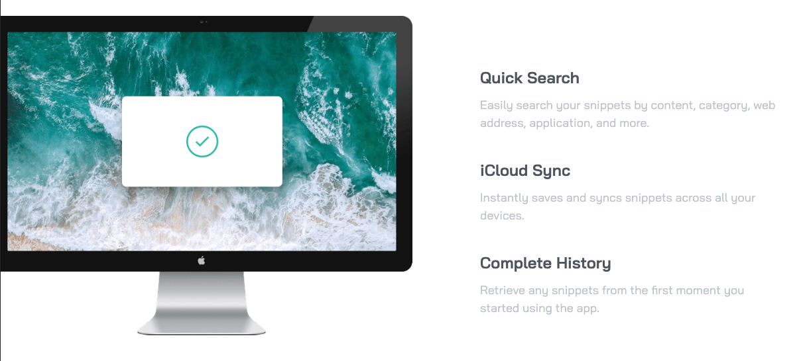

# Frontend Mentor - Clipboard landing page solution

This is a solution to the [Clipboard landing page challenge on Frontend Mentor](https://www.frontendmentor.io/challenges/clipboard-landing-page-5cc9bccd6c4c91111378ecb9). Frontend Mentor challenges help you improve your coding skills by building realistic projects. 

## Table of contents

- [Frontend Mentor - Clipboard landing page solution](#frontend-mentor---clipboard-landing-page-solution)
  - [Table of contents](#table-of-contents)
  - [Overview](#overview)
    - [The challenge](#the-challenge)
    - [Screenshot](#screenshot)
    - [Links](#links)
  - [My process](#my-process)
    - [Built with](#built-with)
    - [What I learned](#what-i-learned)
    - [Continued development](#continued-development)
    - [Useful resources](#useful-resources)
  - [Author](#author)

**Note: Delete this note and update the table of contents based on what sections you keep.**

## Overview

### The challenge

Users should be able to:

- View the optimal layout for the site depending on their device's screen size
- See hover states for all interactive elements on the page

### Screenshot



### Links

- Solution URL: [GitHub](https://github.com/BelumS/frontend-mentor-challenges/tree/main/css-projects/clipboard-landing-page)
- Live Site URL: [Netlify](https://rococo-stardust-5c1d08.netlify.app/)

## My process

### Built with

- Semantic HTML5 markup
- CSS custom properties
- SASS
- Flexbox
- Mobile-first workflow


### What I learned

I learned how to create a landing page and refined my flexbox skills. 

To see how you can add code snippets, see below:

I learned how to make a button appear like it's coming out of the page.
```scss
    &--green {
        background-color: var.$theme-primary;
        box-shadow: 0 3px 1px 1px darken(var.$theme-primary, 3%);
    }
```

I learned how to change the color of an image:
```scss
    &__social {
        ...

        &-icon {
            ...

            &:hover,
            &:focus {
                filter: opacity(0.5) drop-shadow(0 0 0 var.$theme-primary); 
            }
        }
    }
```

### Continued development

I want to continue developing my skills with flexbox, positioning, components, and whitespace management.

### Useful resources

- [Box Shadow](https://www.cssmatic.com/box-shadow) - This helped me generate my desired `box-shadow` for the call-to-action buttons.
- [Change Image Color](https://www.delftstack.com/howto/css/css-change-image-color/) - This helped me change the social media icon active states.


## Author

- Frontend Mentor - [@Bemsa](https://www.frontendmentor.io/profile/bemsa)
