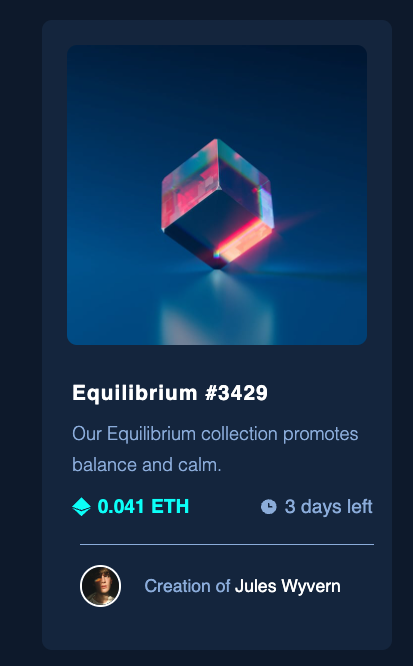

# Frontend Mentor - NFT preview card component solution

This is a solution to the [NFT preview card component challenge on Frontend Mentor](https://www.frontendmentor.io/challenges/nft-preview-card-component-SbdUL_w0U). Frontend Mentor challenges help you improve your coding skills by building realistic projects. 

## Table of contents

- [Frontend Mentor - NFT preview card component solution](#frontend-mentor---nft-preview-card-component-solution)
  - [Table of contents](#table-of-contents)
  - [Overview](#overview)
    - [The challenge](#the-challenge)
    - [Screenshot](#screenshot)
    - [Links](#links)
  - [My process](#my-process)
    - [Built with](#built-with)
    - [What I learned](#what-i-learned)
    - [Continued development](#continued-development)
    - [Useful resources](#useful-resources)
  - [Author](#author)

## Overview

### The challenge

Users should be able to:

- View the optimal layout depending on their device's screen size
- See hover states for interactive elements

### Screenshot



### Links

- Solution URL: [GitHub](https://github.com/BelumS/frontend-mentor-challenges/tree/main/nft-card)
- Live Site URL: [Netlify](https://phenomenal-kringle-6a4ad8.netlify.app)

## My process

### Built with

- Semantic HTML5 markup
- Flexbox
- Mobile-first workflow
- SCSS


### What I learned

To see how you can add code snippets, see below:

I learned to position with `column-gap` when flex-items `space-between` failed me.

```scss
&__details {
    @include mix.flexCenter;
    column-gap: 80px;

    @include mix.respond(land-mobile) {
        column-gap: 70px;
    }
}        
```

The very valuable mixins.
```scss
@mixin absCenter {
    position: absolute;
    top: 50%;
    left: 50%;
    transform: translate(-50%, -50%);
}

@mixin show {
    visibility: visible;
    opacity: 1;
}

@mixin hide {
    visibility: hidden;
    opacity: 0;
}

@mixin defaultTransition {
    transition: all .2s;
}
```

The image overlay for the `:active` state.
```scss
    &__top {
        ...

        &:active &-img {
            opacity: 0.9;
        }

        &:active &-overlay {
            @include mix.show;
        }

        &-overlay {
            @include mix.absCenter;
            @include mix.box(270px);
            border-radius: 10px;
            padding: 25px;
            background-color: rgba(var.$theme-secondary, 0.7);
            cursor: pointer;
            @include mix.defaultTransition;
            @include mix.hide;

            @include mix.respond(land-mobile) {
                @include mix.box(300px);
            }

            &-img {
                @include mix.absCenter;
            }
        }
    }
```

### Continued development

I want to continue using Flexbox and master the concepts, as well as positioning and alignment of elements.

### Useful resources

- [Image Overlay](https://www.w3schools.com/howto/howto_css_image_overlay.asp) - This helped me figure out the image overlay.
- [Flexbox Tips](https://css-tricks.com/snippets/css/a-guide-to-flexbox/#aa-flexbox-tricks) - This helped me with some flexbox issues.

## Author

- Frontend Mentor - [@BelumS](https://www.frontendmentor.io/profile/BelumS)

