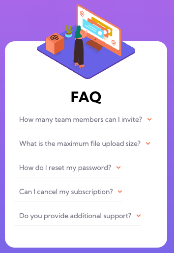

# Frontend Mentor - FAQ accordion card solution

This is a solution to the [FAQ accordion card challenge on Frontend Mentor](https://www.frontendmentor.io/challenges/faq-accordion-card-XlyjD0Oam). Frontend Mentor challenges help you improve your coding skills by building realistic projects. 

## Table of contents

- [Frontend Mentor - FAQ accordion card solution](#frontend-mentor---faq-accordion-card-solution)
  - [Table of contents](#table-of-contents)
  - [Overview](#overview)
    - [The challenge](#the-challenge)
    - [Screenshot](#screenshot)
    - [Links](#links)
  - [My process](#my-process)
    - [Built with](#built-with)
    - [What I learned](#what-i-learned)
    - [Continued development](#continued-development)
  - [Author](#author)

## Overview

### The challenge

Users should be able to:

- View the optimal layout for the component depending on their device's screen size
- See hover states for all interactive elements on the page
- Hide/Show the answer to a question when the question is clicked

### Screenshot



### Links

- Solution URL: [GitHub](https://github.com/BelumS/frontend-mentor-challenges/tree/main/js-projects/)
- Live Site URL: [Netlify]()

## My process

### Built with

- Semantic HTML5 markup
- CSS custom properties
- Flexbox
- CSS Grid
- Mobile-first workflow

### What I learned

I learned how to:
- Add event listeners to multiple elements in a list
- Traverse the DOM tree to and update only the specified elements
```js
cardAccordions.forEach(accordion => {
  const cardTop = accordion.firstElementChild;
  const accordionText = cardTop.firstElementChild;
  const arrows = cardTop.lastElementChild;
  const upArrow = arrows.firstElementChild;
  const downArrow = arrows.lastElementChild;
  const cardBottom = accordion.lastElementChild;

  downArrow.addEventListener('click', () => {
    toggle(downArrow);
    add(upArrow);

    accordionText.style.fontWeight = '600';
    accordionText.style.color = 'black';

    cardTop.style.paddingBottom = '3px';
    cardTop.style.border = 'none';

    add(cardBottom, 'active');
    cardBottom.style.paddingBottom = '10px';
    cardBottom.style.borderBottom = borderBottomStyle;
  });
  ...
});
```

- Create a Dropdown Element 

- Use `background-image` over an `` so I could respond with a different sized image
```html
<div class="card__img">&nbsp;</div>
```
```scss
    &__img {
        @include mix.box(200px);
        ...
        background: url(../images/illustration-woman-online-mobile.svg) no-repeat;
        ...
    }    
```

### Continued development

I want to learn to use Flexbox and Grid to create seamless alignments that can be easily altered. I also want to improve my JS skills,
as I struggled on that, as well as maintaining the proper CSS after toggling elements.

## Author

- Frontend Mentor - [@BelumS](https://www.frontendmentor.io/profile/BelumS)
