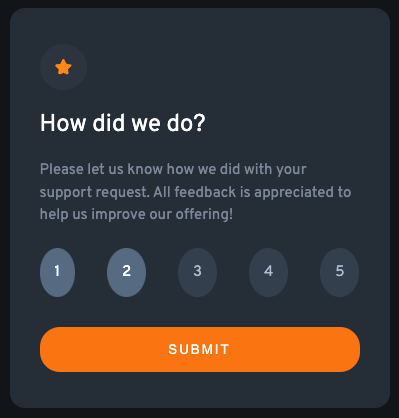
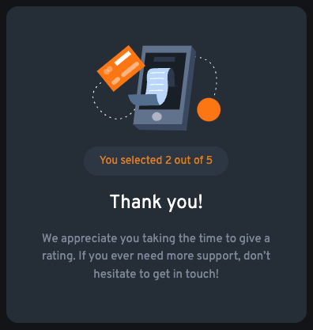

# Frontend Mentor - Interactive rating component solution

This is a solution to the [Interactive rating component challenge on Frontend Mentor](https://www.frontendmentor.io/challenges/interactive-rating-component-koxpeBUmI). Frontend Mentor challenges help you improve your coding skills by building realistic projects. 

## Table of contents

- [Frontend Mentor - Interactive rating component solution](#frontend-mentor---interactive-rating-component-solution)
  - [Table of contents](#table-of-contents)
  - [Overview](#overview)
    - [The challenge](#the-challenge)
    - [Screenshot](#screenshot)
    - [Links](#links)
  - [My process](#my-process)
    - [Built with](#built-with)
    - [What I learned](#what-i-learned)
    - [Continued development](#continued-development)
  - [Author](#author)

## Overview

### The challenge

Users should be able to:

- View the optimal layout for the app depending on their device's screen size
- See hover states for all interactive elements on the page
- Select and submit a number rating
- See the "Thank you" card state after submitting a rating

### Screenshot

;
;

### Links

- Solution URL: [GitHub](https://github.com/BelumS/frontend-mentor-challenges/tree/main/js-projects/rating-card)
- Live Site URL: [Netlify](https://wondrous-zuccutto-e9a615.netlify.app/)

## My process

### Built with

- Semantic HTML5 markup
- SASS
- Flexbox
- Mobile-first workflow
- JavaScript

### What I learned


How to choose what elements are displayed based on button click.

```html
<section class="card card--rating active">...</section>
```

```scss
.card {
    ...
    &--rating {
        ...
        display: none;
    }
...
    &--thanks {
        ...
        display: none;
    }
...
}

.active {
    display: flex;
}
```

```js
submitBtn.addEventListener('click', (e) => {
    e.preventDefault();

    ratings.forEach(r => {
        if(r.classList.contains('selected')) {
            thanksCard.classList.add('active');
            ratingCard.classList.remove('active');
            thanksMessage.textContent = `You selected ${count} out of 5`;
        } else {
            return;
        }
    });
});
```

How to toggle clicked elements on the screen.
```scss
.selected {
    background-color: rgba(var.$color-blue-dark-1, 0.9);
    filter: brightness(250%);
}
```

```js
ratings.forEach(r => {
    r.addEventListener('click', () => {
        r.classList.toggle('selected');
        count++;
    });
});
```

If you want more help with writing markdown, we'd recommend checking out [The Markdown Guide](https://www.markdownguide.org/) to learn more.

### Continued development

I want to continue my CSS expertise, and also make my JS more efficient.

## Author

- Frontend Mentor - [@BelumS](https://www.frontendmentor.io/profile/BelumS)

