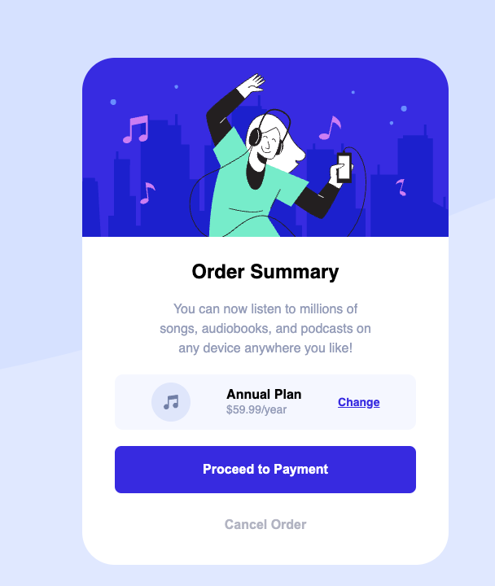

# Frontend Mentor - Order summary card solution

This is a solution to the [Order summary card challenge on Frontend Mentor](https://www.frontendmentor.io/challenges/order-summary-component-QlPmajDUj). Frontend Mentor challenges help you improve your coding skills by building realistic projects. 

## Table of contents

- [Frontend Mentor - Order summary card solution](#frontend-mentor---order-summary-card-solution)
  - [Table of contents](#table-of-contents)
  - [Overview](#overview)
    - [The challenge](#the-challenge)
    - [Screenshot](#screenshot)
    - [Links](#links)
  - [My process](#my-process)
    - [Built with](#built-with)
    - [What I learned](#what-i-learned)
    - [Continued development](#continued-development)
  - [Author](#author)

**Note: Delete this note and update the table of contents based on what sections you keep.**

## Overview

### The challenge

Users should be able to:

- See hover states for interactive elements

### Screenshot



### Links

- Solution URL: [Add solution URL here](https://your-solution-url.com)
- Live Site URL: [Add live site URL here](https://your-live-site-url.com)

## My process

### Built with
- Semantic HTML5 markup
- Flexbox
- SCSS
- Mobile-first workflow

### What I learned

I learned this time that only `block` elements can be considered as flex-items, so I had to wrap some of the text in empty `<div></div>` tags.

To see how you can add code snippets, see below:

Using this **mixin** I was able to successfully apply the breakpoints in a Mobile-1st Approach!

```scss
@mixin respond($bp) {
    @if ($bp == port-mobile) {
        @media only screen and (min-width: var.$bp-port-mobile) { @content; }
    }

    @if ($bp == land-mobile) {
        @media only screen and (min-width: var.$bp-land-mobile) { @content; }
    }

    @if ($bp == tablet) {
        @media only screen and (min-width: var.$bp-tablet) { @content; }
    }

    @if ($bp == laptop) {
        @media only screen and (min-width: var.$bp-laptop) { @content; }
    }

    @if ($bp == desktop) {
        @media only screen and (min-width: var.$bp-desktop) { @content; }
    }

    @if ($bp == lg-desktop) {
        @media only screen and (min-width: var.$bp-lg-desktop) { @content; }
    }
}
```

The subtle adjustments to the card:
```scss
.card {
    ...
    transition: width .2s;

    @include mix.respond(land-mobile) {
        width: max-content;
    }

    ...
    &__lower {
        ...

        & > * {
            ...
            width: 300px;
            transition: width .2s;

            @include mix.respond(land-mobile) {
                width: 350px;
            } 

            @include mix.respond(tablet) {
                width: 370px;
            } 
            ...
        }
    }
}
```

### Continued development

I want to continue to work on positioning, alignment, and flexbox.

## Author
- Frontend Mentor - [@BelumS](https://www.frontendmentor.io/profile/BelumS)
